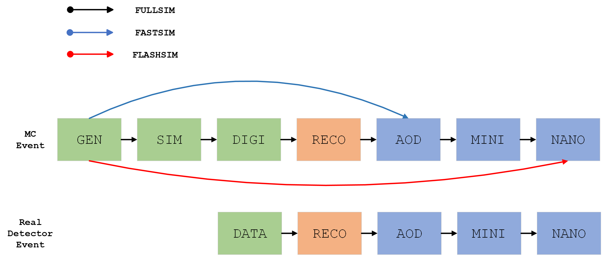

## Normalizing FlashSim: A Deep Learning Approach to the HEP simulation problem

The current repository presents the original code implementation for a *Flash Simulation* approach at the CMS experiment based upon *Normalizing Flows*.
Please consult the [docs](https://francesco-vaselli.github.io/nfs/) for a more comprehensive discussion.
The basic idea is expressed below:

The proposed FlashSim would be able of performing realistic
NanoAOD production and effectively bypassing all the intermediate steps. The FullSim chain is showed above, along with the
CMS FastSim and our FlashSim approaches. We show below the
real data processing chain: the RECO and file formats steps are
in common between the two. 

### End-to-end analysis sample generator

We also present the code of the general idea for an end-to-end analysis
sample generator in the NanoAOD format. The key concept can be
easily grasped through the figure above: a FullSim NanoAOD file gets
processed and its Gen-level values extracted for eventual preprocessing. Then, the values, along with random noise, are passed to the two networks, which generate
raw samples which are finally postprocessed to reobtaine physical
distributions and combined into a single, NanoAOD-like file format.
The whole process can be executed by a single call to a Python script,
which leverages the ROOT C interpreter for running the extraction and
the uproot package for structuring and saving the data directly in the
*.root* format, in a corresponding TTree data structure.
