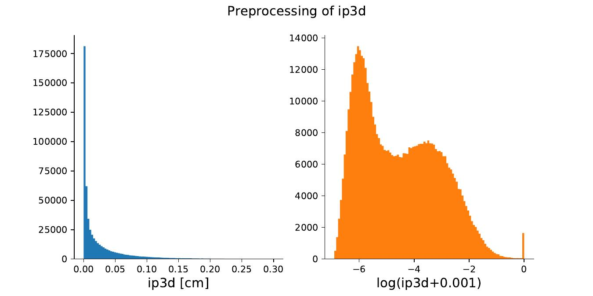

## What we did and why we did it

We processed the NanoAOD files and extracted all the Jet objects matched to a GenJet object and the Muon objects matched to a GenMuon across all the events in the file.
The output of the *extraction* step is another `.root` file containing just the selected objects. We need this 1-to-1 matching because we want to pass the RECO objects as targets and the corresponding Gen objects as *conditioning* to the models (see [Trainings][1] section), that is we want the output to depend on the physical inputs of the various possible processes.

The resulting file is still organized according to the Events structure (that is, a single event may contain an arbitrary number of jets and muons). Besides, we know that many machine learning algorithms work best when specific distributions are *preprocessed* according to specifc criteria. Normalizing Flows are no exception. Specifically, there are four key features which should be accounted for and modified through preprocessing before training:


1. Because NF are learning actual pdfs, *large gaps* between values of the distribution may disturb training and trick the network to *bridge* the extremes of the distribution by creating spurious samples in the gap. When possible, the gaps should be reduced and the values packed closer together;

2. As NF assume a continuous and differentiable pdf, they are not well suited to deal with *discrete* distributions. Thus, we should apply a process known as *dequantization*, that is applying some sort of smearing to the discrete values to make them similar to those sampled from a continuous distribution;

3. For similar reasons as before, when possible it would be beneficial to widen and normalize steeply falling distributions through invertible transforms such as log(x). If well separated, eventual peaks may be dequantized as well;

4. Finally, we opted for *saturating* long tails of distributions to some limiting values, in order to make it easier for the model to learn the pdf in the more populated region.


Apart from possibly dequantization, we stress that all of this transformations were implemented to make training easier but are not strictly necessary--the models revealed themselves as powerful enough to deal with complex, sharply peaked, long tailed distributions. However, having already implemented the preprocessing pipeline and because it did not introduce a big overhead in the procedure, we decided to keep it for the present work. An example of one of the possible preprocessing operations is shown in the following figure:




Sharply peaked distribution are being converted to more broad ones during the preprocessing step. In this example the `ip3d` variable, the 3D impact parameter of the $\mu$ w.r.t. the primary vertex, gets transformed as log(`ip3d`+0.001).

All of these transforms may be implemented with a clear and natural syntax in the `Python` programming language, specifically thanks to the `pandas` package, which implements a convenient dataframe structure.

## Extraction details

First, we extract the Gen and RECO objects from an existing NanoAOD file. With the use of `C/C++` code (e.g. [muons_extraction.cpp][2] )
for the `ROOT` data analysis framework, this operation can be performed rather quickly thanks to the *compiled* nature of the language being used and the powerful `ROOT::RDataFrame()` class, offering a modern, high-level interface for the manipulation of data stored in a NanoAOD `TTree`, as well as `multi-threading` and other low-level optimizations.

The basic idea for the extraction process is to define some functions and using the `df.Define()` method for calling the function on the selected rows and columns

```c
auto DeltaPhi(ROOT::VecOps::RVec<float> &Phi1, ROOT::VecOps::RVec<float> &Phi2) {
	/* Calculates the DeltaPhi between two RVecs
	*/
	auto size = Phi1.size();
   	ROOT::VecOps::RVec<float> dphis;
	dphis.reserve(size);
	for (size_t i = 0; i < size; i++) {
		Double_t dphi = TVector2::Phi_mpi_pi(Phi1[i]-Phi2[i]);
		dphis.emplace_back(dphi);
	}
	return dphis;
	}

//stuff 

// f is NanoAOD file
ROOT::RDataFrame d("Events",f);

// create first mask
auto d_def = d.Define("MuonMask", "Muon_genPartIdx >=0").Define("MatchedGenMuons", "Muon_genPartIdx[MuonMask]");

// The main rdataframe, LAZILY defining all the new processed columns.
// here we show the extraction of Delta Phi between gen and reco muons
auto d_matched = d_def
            .Define("MMuon_filteredphi", "Muon_phi      [MuonMask]")
			.Define("MMuon_phiMinusGen", DeltaPhi,  {"MMuon_filteredphi", "MGenMuon_phi"})
            .//other Define()s

// finally process columns and save to .root file
d_matched.Snapshot("MMuons", "MMuons.root", col_to_save);
```
The output of the *extraction* step is another *.root* file containing just the selected objects. 

## Ok, but what do we want to extract?!

Please read this only if you are interested in the full list of targets and conditioning variables--it is quite a lengthy section and not that useful for later.

The idea is being able to directly generate correctly distributed Jet objects starting from noise, for stochasticity,  but also from the values of a corresponding GenJet, as a physical-informed input for the network (a process known as *conditioning*): knowing just the generator-level information of some process, we are going to skip the Simulation, Digitization and Reconstruction steps.

Because of the large number of variables, we selected a meaningful subset, containing all the necessary information for our test analysis.

### Jet conditioning

First of all, we selected the following 14 GenJet variables for conditioning the generation: 


1. **The physical properties** of the GenJet, that is $\eta$, $\phi$, $m_j$, $p_T$, and the 
2. **Parton** and **Hadron Flavour**, giving the *flavour* content of a jet as containing a specific quark or some gluons;

3. **Variables correlated with the rest of the event**, as the actual properties of a jet are expected to be influenced by other objects such as muons. Computing the $\Delta$R separation between the GenJet and the GenMuons present in the event, we selected the first and second *closest muons*, and we computed the following quantities for each one:
   - $\Delta$R, giving the separation from the GenJet, $\Delta \eta$, the $\eta$ difference from the GenJet, $\Delta p_T$, the $p_T$ difference from the GenJet, $\Delta \phi$, the $\phi$ difference from the GenJet;

3. If no GenMuons were present within a cone of $\Delta$R = 0.5 from the GenJet, the corresponding values were set to a user-defined maximum.

### Jet targets

Then, we selected the following 17 target reconstructed variables for the matched reconstructed Jet objects:

1. **The physical properties** of the Jet *with regard to* the ones of the matched GenJet: $\Delta\eta$, the $\eta_{reco} - \eta_{gen}$ difference , $\Delta\phi$, the $\phi$ difference, $R_m$, the ratio of the jet and GenJet masses, $R_{p_T}$, the ratio of $p_T$s. This was done because the Simulation and Reconstruction steps are expected to introduce corrections w.r.t. the GenJet distributions, easier to learn when considering these quantities. As an additional variable, the Jet Area, a measure of its susceptibility to radiation, like pile-up or underlying event, was added as well;

2. Some of the btag discriminant variables **b-tagging and c-tagging algorithms scores**: btagCMVA, btagCSVV2, btagDeepB, btagDeepC, btagDeepFlavB and btagDeepFlavC, which indicate with a score ranging from 0 to 1 whether the Jet contains the respective quark or not, a very significant information for performing event selection during an analysis. Some values may be offsetted to -1 to indicate that the corresponding tagging algorithm has failed to assign a score to the event;

3. **The bRegCorr**, the $p_T$ correction for b-jet energy regression, as the presence of neurinos due to semi-leptonic decays in the jets coming from b quarks can result in underestimated jet energy measurements;

4. **The qgl score** for the Quark vs Gluon likelihood discriminator, which is employed as most of the interesting physics channels studied at the LHC involve hadronic jets initiated by quarks, while dominant backgrounds often arise from QCD events, where jets are generally produced from gluons;

5. **The jetID and puID ID flags** indicating relevant characteristics of the jet as well as the event noise and pile-up.

### Muons conditioning

For muons we performed the same procedure, taking only those muons matching to GenMuon objects (a GenParticle object with pdgId value of +-13). 

We selected 30 GenMuon variables for conditioning:


1. **The physical properties** of the GenMuon, that is $\eta$, $\phi$, Charge and $p_T$;

2. **The 14 GenParticle status flags**, a series of \statusFlags stored bitwise, with each bit having a different physical interpretation such as *isTauDecayProduct*, *fromHardProcess*, etc. ;

3.  **Variables correlated with the rest of the event**, as the actual properties of a muon are expected to be influenced by other objects such as jets. Computing the $\Delta$R separation between the GenMuon and the GenJets present in the event, we selected the first *closest GenJet*, and we computed the following quantities:
	- $\Delta$R, giving the separation from the GenJet, $\Delta\eta$, the $\eta_{muon} - \eta_{jet}$ difference, $R_{p_T}$, the ratio of $p_T$s, $\Delta\phi$, the $\phi$ difference, and finally the $m_j$ of the closest GenJet;
  

4. A series of 6 **Event level variables regarding pile-up**: Pileup\_gpudensity, the Generator-level PU vertices/mm,Pileup\_nPU, the number of pile-up interactions that have been added to the event in the current bunch crossing, Pileup\_nTrueInt, the true mean number of the poisson distribution for this event from which the number of interactions each bunch crossing has been sampled, Pileup\_pudensity, PU vertices/mm, Pileup\_sumEOOT, the number of early out of time pile-up and Pileup\_sumLOOT, the number of late out of time pile-up;

### Muons targets

Then we selected 22 target variables for the Muon objects:


1. **The physical properties** of the muon **with regard to** the ones of the matched GenMuon: $\Delta\eta$, the $\eta_{reco} - \eta_{gen}$ difference , $\Delta\phi$, the $\phi$ difference, $R_{p_T}$, the ratio of Gen vs reco $p_T$s. This was done because the Simulation and Reconstruction steps are expected to introduce corrections w.r.t. the GenMuon distributions, easier to learn when considering these quantities. As an additional variable, the \texttt{ptErr}, the $p_T$ error for the muon track, was selected as well;

2. Six **impact parameters** with respect to the primary vertex, related to the impact parameter *d*, defined at the distance between the daughter particle trajectory and the mother particle production point. It can be defined by first minimizing the distance on a plane, definig dxy, dxyErr and then minimize on the remaining axis dz, with its dzErr. Alternatively, we can minimize the distance directly in 3 dimensions, obtaining the 3D impact parameter ip3d and its significance sip3d, all expressed in cm;

3. Some **Boolean flags** expressing relevant properties of the object as identified by reconstruction algorithms: isGlobal, isPFcand, identifying the muon as a Particle Flow candidate, isTracker;

4. A series of **isolation variables** returned by the Particle Flow algorithm: pfRelIso03\_all, pfRelIso03\_chg and pfRelIso04\_all;

5. The **variables related to the closest jet**: jetPtRelv2, indicating the relative momentum of the lepton with respect to the closest jet after subtracting the lepton and jetRelIso, the relative isolation in matched jet;

6. A series of **ID scores**: mediumID, softMVA scores and their cut-based Boolean IDs softMVAId, softId;


 [1]: <https://francesco-vaselli.github.io/FlashSim/trainings/> "The next section" 

 [2]: <https://github.com/francesco-vaselli/FlashSim/blob/main/preprocessing/muons_extraction.cpp> "muons script" 