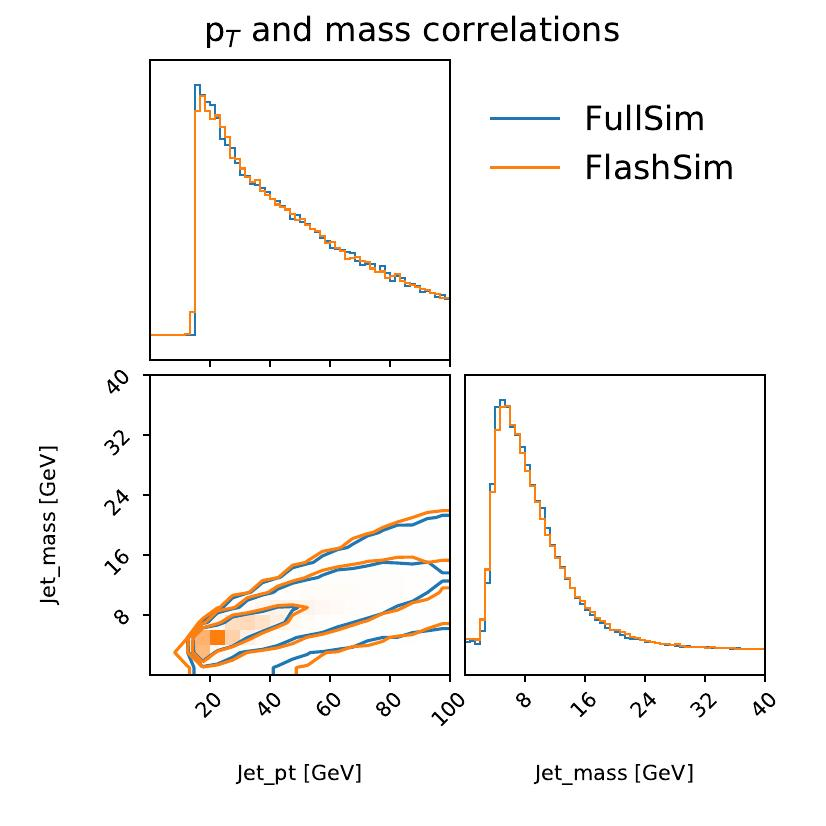

This long section serves to present in a comprehensive way the results obtained.

To perform a sound and reasonable comparison, we extract the Gen-values for conditioning from $10^{5}$ t$\overline{\text{t}}$ samples coming from an unseen test set for jets and from the validation set (which was not used for training but just for evaluating the loss over time) for muons. We then generate new analysis samples using FlashSim and starting from the same Gen-values, to get a one-to-one correspondence between the them and FullSim samples.

We performed two main types of comparison on the obtained samples: we compared the 1-d *distribution* and the 2-d *correlations* for any pair of variables.
We inspected the latter visually thanks to *contour plots*, but we wanted to have a precise measure for the similarity of the empirical distributions between two samples. We thus choose the *Wasserstein distance*, defined as:

$$W_1(u, v) = \inf_{\pi \in \Gamma(u, v)}\int_{\mathbb{R}\times\mathbb{R}}|x-y|d\pi(x,y) = \int_{-\infty}^{+\infty} |U - V|$$

where $\Gamma(u, v)$ is the set of (probability) distributions on $\mathbb{R}\times\mathbb{R}$ whose marginals are $u$ and $v$ on the first and second factors respectively, and $U$, $V$ are the respective CDFs. Intuitively, if each distribution is viewed as a unit amount of earth (soil), the metric is the minimum *cost* of turning one pile into the other, which is assumed to be the amount of earth that needs to be moved times the mean distance it has to be moved, and thus this metric is also know informally as the *earth mover distance*.

## Jets Results

### 1D

We show in the following figure four 1-d distributions out of the total of 17 target variables obtained for jets. We emphasize once more that the model actually learned to generate the 17 values simultaneously, preserving the correct correlations as well as producing convincing distribution.

Regarding the distributions, we observe that the model has correctly learned all the multi-modal, sharply peaked tagging distributions with Wasserstein scores of the order of $0.001$, testifying good convergence. The log scale of btagDeepB actually shows an instance of *bridging*, where a small set of values were generated between two separate peaks. Single-mode distributions such as ptRatio have been larned as well, as were the Ids thanks to dequantization. The jetId outputs were rounded to the closest value between 0, 2 and 6, the only admissible ones.

Finally, we also observe a worse performance on two distributions: bRegCorr, a rather simple, skewed one-mode distribution which is expected to improve with further training (current Wasserstein distance is $\approx$ 0.02), and nConstituents. The latter result is probably in stronger disagreement because the target actually consists of integer values--as we discussed before, the NF approach expects continuous distributions, and so the model performs bridging in an attempt to obtain a reasonable continuous distribution. However, it has been observed in previous trainings for similar architectures that the model is actually capable of partially overcoming this limitation by brute force alone: if left in training for long enough it may eventually learn to output values close to the integer ones.

### Jets correlations

The correlations between jets variables, inspected visually, show good agreement with those from FullSim. The following figures shows the highly non-trivial correlations between the tagging distributions, with *quantiles* plotted at 0.5, 0.9, 0.99. The same choice for quantiles has been adopted for all the following figures.

We can also observe in the following figures how the models have learned to capture the correlations between the qgl score, which is correctly correlated to the number of constituents as a lower number of constituents is expected for the u, d, s quarks when compared to gluons. Additionally, correlations between the physical p$_T$ and mass distributions, obtained from the original p$_T$Ratio and massRatio outputs of the network, have been learned as well.

## Muons results

### 1D

For the muons, we obtained similar results--good, convincing general convergence and correlations apart from a subset of the target variables. It should be noted that a larger number of target variables for this case were actually Boolean Ids, and as discussed before were approached through dequantization. The following figures shows 4 distributions out of 22 target variables. Aside from good convergence on the firs two, we can observe that for a series of them, such as the impact parameters errors dxyErr and dzErr the training is complicated by the fact that the NanoAOD format stores the variables in a low-precision format: this is reflected by the jagged structure in the plot for FullSim and it causes the model to perform bridging to reach convergence.

### Correlations

Finally, as a last example of correlations, we show in the following that the model has actually learned to capture complex correlations such as the ones between the *impact parameter* ip3d and the quantity $\sqrt{\texttt{dxy}^2 + \texttt{dz}^2}$, which is closely related to the definition of the impact parameter itself.

## Conditioning

Another extremely important feature of our approach is the desired ability to obtain specific results starting from certain Gen-level inputs, a characteristic we called conditioning. The idea is that we want to learn not just $p^*_x(\mathbf{x})$, but $p^*_x(\mathbf{x}|\text{Gen})$.

We can readily see that this is possible by focusing on specific results obtained for the jets model. The following shows that the final, NanoAOD level reconstructed p$_T$ is correctly correlated to the GenJet p$_T$ for both FullSim and FlashSim: as we would expect the Gen-p$_T$ is crucial in determining the final-state p$_T$. What is more, in the same figure we also show the *profile histogram* and RMS ($\sigma_{p_T}$/p$_T$) for the GenJet p$_T$ versus the p$_T$Ratio. As expected, not only does the p$_T$Ratio decrease as the GenJet p$_T$ increases (highly energetic jets have a reconstructed p$_T$ closer to the Gen-value), but the RMS correctly decreases as well, as constant terms in the p$_T$ resolution due to pile-up are divided by bigger terms as GenJet p$_T$ increases.

Additionally, because the partonFlavour conditioning variable allow us to specify the quark content of a jet, we can study how related quantities depend on this input. As a key example, we study the behaviour of the btagDeepB b-tagging distribution as we vary the parton input for the jet generation. The next figures show how the distribution changes according to the ground truth value specified as input: as expected, jets being conditioned with a b content present higher values of b-tagging, with a sharp peak at one, while those coming from u, d, s are clearly peaked around smaller values. Now we could think of defining a threshold and assign a reconstructed b content to all those jets higher than that value. We would naturally mistag some events, leading us to define a *flase-positive* ratio and a *true-positive* one. A standard figure of merit for these cases is the *Receiving operating characteristic* (ROC) curve, which plots the TPR against the FPR for all possible threshold choices. The last figure shows it for our model in log scale, showing minimal deviations from the target FullSim curve.

Because our results are not as close to FullSim as it was for 2-d correlations, we would like to compare them with other competing approaches to asses the goodness of our own methodology. In order to do so, for a previous training with a lower number of jet target variables, presented at the CMS Machine learning Forum of April 2022, we compared the ROC curves between FullSim, FastSim and FlashSim on a $10^{6}$ t$\overline{\text{t}}$ samples set (not previously seen during training). Results are shown in the next Figure. We can see that while the ROC between our approach and FullSim is actually indistiguishable for TPR higher than 0.8, the FastSim ROC completely *overshoots* the target, due to oversimplifications in the simulation approach. With longer training times and additional loss terms addressing this type of conditioning, which is currently not considered by the model loss function, we are confident that the performance of FlashSim could be improved even more.

## Speed

A crucial result obtained is the *generation speed*: for both jets and muons we managed to generate samples in batches of $10^{4}$ in $\approx$ 0.3 seconds each, corresponding to a generation speed of raw samples of about 33,300 *samples per second* (33 kHz) *meaning a six orders of magnitude speedup when compared to FullSim and four orders of magnitude speedup when compared to FastSim*! Even considering possible reduction due to preprocessing and data loading, this result testify to the potential of the current methodology to completely redefine our approach to event simulation, at least at the NanoAOD level.

What is more, the $10^{4}$ batch size for generation was limited only by the VRAM of the GPU being used, meaning that more powerful GPUs, ideally working in parallel, could achieve even faster generation times.

## Results on unseen processes

We actually extended the use of the models to *unseen, different physical processes*: *Drell-Yan two-jets* (DY), *Electroweak two-muons two-jets* (EWK LLJJ) and two *Signal* (H$\rightarrow\mu^+\mu^-$) datasets were processed as well and stored for the comparison of the next chapter. Some results, are showed below and emphasize how our approach has correctly learned to simulate the interaction and reconstruction of the CMS detector, giving consistent results independently from the input process.

## Benchmark analysis

Having described in detail our innovative approach to event simulation, and having applied it to generated events for which we have the FullSim sample, we decided to repeat the basic steps of a recent analysis to demonstrate the feasibility of our model in a real-case scenario.

### The Higgs decay into two muons

We generated a FlashSim dataset from the Gen-level information of the existing NanoAOD FullSim datasets for the different processes discussed before, that is:

1. The t$\overline{\text{t}}$ inclusive production (also used in training);
2. The DY+2J process;
3. The EWK production of $\mu\mu$+2J;
4. The Higgs VBF production, with the Higgs decaying into pairs of $\mu$.

We then performed the preliminary selection steps of the analysis presented in the [analysis][1], specifically that of VBF Channel of H$\rightarrow\mu^+\mu^-$, for the reasons discussed previously.
The objective was to verify that the selected objects distributions were close enough to those obtained from FullSim.

### Event selection

First of all, we select muons as follows:

1. pfRelIso04\_all$= \sum_{\Delta R(PF_i, \mu)<0.4}p_T^i/p_T^{\mu}<0.25$ (isolated);
2.  Muons passing the \emph{medium} muon Id algorithm;
3.  $p_T^{\mu}>20$ GeV;
4.  $|\eta_{\mu}|<2.4$.

These are all features we would expect from a pair of muons decaying from a Higgs. An event is also required to have at least two opposite charged muons.

In a similar way, we select the jets as those passing the following cuts:

1. $p_T^{jet}>25$ GeV 
2. Additionally, for $p_T^{jet}<50$ GeV we require it to pass the pile-up Id algorithm;
3.  Jets passing the *jet* Id algorithm;
4.  $|\eta_{jet}|<4.7$;
5. We also require that jets do not overlap with muons within a $\Delta R\leq0.4$ cone.

A VBF candidate event is required to have at least two jets respecting the previous properties, one with $p_T>35$ GeV, the other with $p_T>25$ GeV, an invariant mass of the leading jet pair $m_{jj}>400$ GeV and a separation between the leading jets of $\Delta\eta>2.5$. Selected events are further grouped into two independent categories. Events in which the two muons form an invariant mass between 115 and
135 GeV belong to the signal region (VBF-SR), which is enriched in signal-like events. Events with 110 < $m_{\mu\mu}$ < 115 GeV or 135 < $m_{\mu\mu}$ < 150 GeV belong to the mass sideband region (VBF-SB), which in the full analysis has been used as a control region to estimate the backgroung.

For each selected event we define the new, derived quantities that help discriminating the Higgs signal from the SM processes that represent a background for this analysis. Some crucial ones are:

1. The reconstructed *Higgs-candidate*, with a 4-momentum given by the sum of the two four-vectors of the selected muons;
2. Observables sensitive to $p_T$ and angular correlations between muons and jets: 

The $p_T$*-balance ratio*, defined as:

$$
R(p_T) = \frac{|\mathbf{p_T}^{jj}+\mathbf{p_T}^{\mu\mu}|}{p_T(j_1) + p_T(j_2) + p_T^{\mu\mu}}
$$

and the *Zeppenfeld variable* $z^*$, defined from the *rapidity y* as:

$$z^* = \frac{y_{\mu\mu} - (y_{j_1} + y_{j_2})/2}{|y_{j_1} - y_{j_2}|}$$

1.  The azimuthal angle ($\phi_{CS}$) and the cosine of the polar angle ($\cos\theta_{CS}$) computed in the dimuon *Collins–Soper* rest frame.

The next Figure shows the $R(p_T)$ and the $\log(z^*)$ for the Signal and the DY Background process, emphasizing how these quantities can be used to discriminate between the two. The Figure also introduces the FullSim vs FlashSim comparison and will be referenced again in the following.

### A DNN for event classification

The CMS Collaboration used a deep neural network (DNN) multivariate discriminant, trained to distinguish the expected signal from background events using kinematic input variables that characterize the signal and the main background processes in the VBF-SR. The signal is then extracted from a *binned maximum-likelihood fit* to the output of the DNN discriminator simultaneously in the VBF-SR and the VBF-SB regions. 

The DNN used in the final analysis has been tested on the FlashSim samples, with the final weights and parameters resulting from the trainings already performed by the authors of the original paper on the FullSim dataset. We tested the network on our FlashSim data to compare the ouput with the one on the FullSim datasets used in the analysis and taken as Gen-level truth for generating our samples.

The network takes as input 25 variables. The first 23 are listed below:

1. Six variables associated with production and decay of the dimuon pair: its mass $m_{\mu\mu}$, the absolute and relative mass resolutions $\Delta m_{\mu\mu}$, $\Delta m_{\mu\mu}/m_{\mu\mu}$, its momentum $p_T^{\mu\mu}$ and its logarithm, the pseudorapidity $\eta_{\mu\mu}$;

2. The azimuthal angle ($\phi_{CS}$) and the cosine of the polar angle ($\cos\theta_{CS}$), the $p_T$\emph{-balance ratio} $R(p_T)$ and the logarithm of the *Zeppenfeld variable* $z^*$;

3. The vector components of the leading jets, $p_T(j_1)$, $\eta(j_1)$, $\phi(j_1)$, $p_T(j_2)$, $\eta(j_2)$, $\phi(j_2)$, and their QGL scores, $QGL(j_1)$, $QGL(J_2)$, since jets in signal events are expected to originate from quarks, whereas in the DY process they can also be initiated by gluons;

4. Key variables referring to the dijet system: its mass $m_{jj}$ and $\log(m_{jj})$, the pseudorapidity distance between the two jets $\Delta \eta_{jj}$;

5.  The minimum distance in pseudorapidity of the Higgs candidate with the two leading jets $\min(\eta(\mu\mu, j_1),\eta(\mu\mu, j_2))$;

6. The data taking year (set to 2018 for both FullSim and FlashSim samples).

Additionally, the VBF signal events are expected to have suppressed hadronic activity in the rapidity gap between the two leading jets. This feature is exploited by considering *soft jets* in the event that are defined by clustering, via the *anti-*$k_T$ jet-clustering algorithm with a distance parameter of 0.4, charged particles from the primary interaction vertex excluding the two identified muons and those associated with the two VBF jets. The soft jets are required to have $p_T>5$ GeV. The number of soft jets in an event, $N^{\text{soft}}_5$, as well as the scalar sum of their transverse momenta, $H^{\text{soft}}_{(2)T}$, are used as additional input variables. 
Because soft activity depends upon the presence of additional charged particles, which we have not simulated in the present FlashSim prototype, we resorted to fixing the values of these two variables to $N^{\text{soft}}_5=0$ and $H^{\text{soft}}_{(2)T}=1.0$ GeV. As we are interested in performing a comparison of the DNN output for FullSim and FlashSim, using fixed values in the evaluation of both does not bias the results.

### FullSim vs FlashSim

We observe good results on distributions directly related to the simulated targets of FlashSim. The next Figure shows the pfRelIso\_04\_all for lead muons passing the initial selection, which presents small deviations when compared to the FullSim sample, despite the lower number of FlashSim muons passing the selection. The bottom panel shows the ratio between the FlashSim and the FullSim sample, were the chosen convention here and in the following has been to always divide by the FullSim.

However, for jets, the agreement is not as good as for muons. The next figure shows that the $p_T$ for the second selected jet is not as high for FlashSim jets as it is for FullSim ones. We tried to explain this result by remembering that our current prototype of FlashSim is missing *fakes* jets due to noise and pile-up, present in the other sample. In principle, higher-$p_T$ fake jets may be selected in place of the second event jet for some of the FullSim samples, explaining the deviation observed. In fact, fake jets have usually low-$p_T$, under 50 GeV, and we can see that our distribution is perfectly overlapping at high-$p_T$.

The results related to angular distributions also show a good performance. We showed above how the histograms for the $R(p_T)$ and the $\log(z^*)$  of the Higgs vs DY processes, to show how these variables can be *discriminant* in distinguishing between signal and background. At the same time, we can see how FlashSim correctly reproduces the Signal versus Background differences.

We also show the outputs of the VBF DNN discriminator network for each single process, which was used as the fit function for the real analysis. The FlashSim predictions are still very close to the FullSim ones, a crucial result for assessing the potential for real-world analysis applications.

 

An even greater accuracy may be obtained when a FullSim sample is already available and we need alternative samples for estimating systematic uncertainties, e.g.  different *theoretical variations* for the same process. This is the case, for example, for the two samples of the Higgs signal, which differ in the theoretical technique employed for *systematic inclusion of higher order QCD effects*: one employed the *POWHEG* software, the other the *MadGraph5\_aMC@NLO* one. Suppose we had a FullSim reference sample $REF_{Full}$, we computed its FlashSim $REF_{Flash}$ sample as well as that of another possible variation $VAR_{Flash}$. We would expect that the actual $VAR_{Full}$ may be re-obtained faster than a run of FullSim by the factorization:

$$VAR_{Full} = REF_{Full} \frac{VAR_{Flash}}{REF_{Flash}}
$$

as the ratio factors out the FlashSim differences and leaves out only the software sample differences which are then multiplied by the $REF_{Full}$ sample. The following Figure shows that our expectations are met by the FlashSim approach, as the aMC@NLO FullSim variation sample agrees with the ratio calculated from the POWHEG variation sample and the aMC@NLO FlashSim sample. This opens up the way to fast calculations of theoretical variations starting only from a single, pre-existing FullSim sample, implying a considerable speed-up when compared to re-starting always from Gen-level, as it is currently the case.

### FlashSim vs Gen

In order to better understand the added value of FlashSim, we can compare its output to what could be achieved by working directly at the Gen-level. Part of the chosen selection analysis objects may in fact be computed starting from Gen-level information alone, and thus we can ask ourselves if the FlashSim results are significantly different from those obtained with its inputs, the Gen values. In the following, we compare results for the Signal sample considering the three samples of FullSim, FlashSim and Gen.

For the $\log(z^*)$ angular distribution, as the angular resolution is already good at Gen level, and the next figure shows no significant deviations between the three samples. On the other hand, it should be noted that the fraction of events passing the selection (i.e. the integral of the plot) is much better reproduced in FlashSim than at Gen-level.

 
However, as we move to the $R(p_T)$, which depends on the hadronic activity, and thus on the effect of the interaction and reconstruction in the detector, we see the expected differences, as plotted below:

   
Additionally, the importance of the interaction with the detector and of the reconstruction, leading to *smearing* in the distribution of the dimuon mass, is emphasized by the next figure, where we can see that the Gen has only a single, peaked value, while FlashSim has correctly learned the expected smearing.

   
  Finally, this differences also translate to the distribution of the VBF DNN Output, which is the fitted observable in the final analysis, shown below:
  

## Upsampling
  Because the simulation and reconstruction steps are currently much slower than the generation one, when working with FullSim the default choice is to employ a different Gen-level event for each passing through simulation and reconstruction, to maximize the information contained in the final dataset. As our proposed FlashSim has demonstrated significant speed improvements, we decided to experiment with *upsampling*; i.e. generating multiple final-state, NanoAOD-format events from the same Gen-level information. In practice, due to the stochasticity of the simulation step, we are computing the pdf of the reconstructed events for each Gen-event. 

   
  The next Figureshows this is indeed the case: if we generate 10,000 events from the same Signal POWHEG Gen-level value we observe a distribution spread around the single value returned from the conventional, 1-to-1 FlashSim approach, at least for those variables having a strong dependency on experimental resolution, such as the VBF DNN Output. The $\log(z^*)$ is instead sharply peaked around the FullSim value, as it is very precisely reconstructed, hence the simulation+reconstruction value is very close to the generated one. The stochasticity introduced by the Sim step is closely related to the selected variable, and we expect more significant advantages for those variables presenting a good spreading.
  It is also interesting to note that out of the 10,000 generated events only 7,633 pass the analysis selection and are being used to plot the VBF DNN Output distribution.

  
  
   
   The capacity for upsampling offers some important advantages. First of all, if FlashSim is capable of running at 33 kHz, the Gen production is becoming our bottleneck, hence reusing the Gen implies additional resource savings. Additionally, because we are generating more data, we can expect a reduction of the statistical error; however we must correctly compute the uncertainties in this case.
   
   Usually, if we are interested in finding the discrete *pdf* from an histogram, assuming a *poisson* statistics the pdf *i*-th bin and its error are defined as:
   
$$
  pdf_i = \frac{\sum_{ev \in i}{w_{ev}}}{\sum_{ev}{w_{ev}}}; \quad 
      \sigma_i = \frac{\sqrt{\sum_{ev \in i}{w_{ev}^2}}}{\sum_{ev}{w_{ev}}}
$$
  
  Where the *w*s are the weights for each event and they are typically set to 1.
   In the upsampling case instead, we have N upsampled events with a common Gen-event (called *folds*), and thus we obtain:
   
$$
pdf_i = \frac{\sum_{ev}\sum_{fold\in i}{w_{ev}}}{N_{fold}\sum_{ev}{w_{ev}}} = \frac{\sum_{ev}\sum_{fold\in i}{w_{ev}/N_{fold}}}{\sum_{ev}{w_{ev}}} =
\frac{\sum_{ev}{w_{ev}pdf_i^{ev}}}{\sum_{ev}{w_{ev}}}
$$
      
  That is, each event may now enter multiple bins as it has been upsampled by a factor N--this is the same as saying that we can sum the pdf of each single event to obtain the final pdf. For the errors we consider folds from the same events entering different bins as uncorrelated, with a weight proportional to the number of folds entering the same bin. By recovering the initial error formula we get:
  
$$
\sigma_i = \frac{\sqrt{\sum_{ev}(\sum_{fold\in i}{w_{ev}/N_{fold})^2}}}{\sum_{ev}{w_{ev}}} =
  \frac{\sqrt{\sum_{ev}{(w_{ev}pdf_i^{ev})^2}}}{\sum_{ev}{w_{ev}}}
$$
  
  Practically speaking, for each event, we let the N upsampled events fill the histogram, and then defined the pdf of a single event as (bin content)/N, a quantity also used for determining the new statistical error. The resulting pdfs are then summed together to obtain the final histogram. This procedure is necessary to ensure that we are properly accounting for upsampled events filling the same bin--e.g. we want to have no difference between the 1-to-1 approach and the case where all events fill the same bin.
  
  As already discussed, we expect a greater reduction of the errors for those variables heavily influenced by the interaction with the detector.

  
  The following figure shows the comparison for the Signal POWHEG VBF DNN Output between the 1-to-1 FlashSim and the FlashSim upsampled by a factor of 25, whose histogram was filled with the empirical pdfs as described above. The mean statistical error (defined as the mean for the square of the sum of weights squared) is 32.3 for the first case, which gets reduced to 14.2 for the upsampled dataset; approximately by a factor of $1/2$. The relative error, defined as the error per bin divided by the bin content, is also showed in the first lower panel and is clearly decreasing across all bins, while the ratio is approximately one, as expected. For variables reconstructed with very high resolution, i.e. when the simulation+reconstruction does not introduce any significant smearing, such as $\log(z^*)$, we observe a smaller error reduction (11.2 from 14.4), as expected.

  
  
  
  Another important advantage is that we may be able to obtain more smooth, convincing distributions for those cases where the low number of events is a limiting factor. One of such cases is the VBF DNN Output for the DY 2Jets dataset, which has high errors and a jagged distribution as only a tiny fraction of events pass the selection.

  By performing an upsampling by a factor of 25 and comparing the results, we immediately see below that the resulting upsampled VBF DNN Output distribution not only has lower errors, but also manages to produce a more smoothly decreasing and convincing distribution, without the jagged peaks given by the small sample size of the 1-to-1 case.
  
  

The results of the present Chapter demonstrate that not only is FlashSim capable of producing different distributions from those of the bare Gen-level, but also that it can come close to the results yield by FullSim. Additionally, it can fully make use of Gen-level information through the upsampling procedure.

 [1]: <https://link.springer.com/article/10.1007/JHEP01(2021)148> "Full Analysis" 