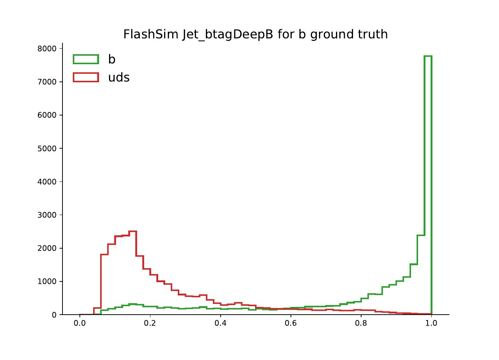

This long section serves to present in a comprehensive way the results obtained.

## Jets Results

### 1D

We show in the following figure four 1-d distributions out of the total of 17 target variables obtained for jets. We emphasize once more that the model actually learned to generate the 17 values simultaneously, preserving the correct correlations as well as producing convincing distribution.

Regarding the distributions, we observe that the model has correctly learned all the multi-modal, sharply peaked tagging distributions with Wasserstein scores of the order of $0.001$, testifying good convergence. The log scale of btagDeepB actually shows an instance of *bridging*, where a small set of values were generated between two separate peaks. Single-mode distributions such as ptRatio have been larned as well, as were the Ids thanks to dequantization. The jetId outputs were rounded to the closest value between 0, 2 and 6, the only admissible ones.

Finally, we also observe a worse performance on two distributions: bRegCorr, a rather simple, skewed one-mode distribution which is expected to improve with further training (current Wasserstein distance is $\approx$ 0.02), and nConstituents. The latter result is probably in stronger disagreement because the target actually consists of integer values--as we discussed before, the NF approach expects continuous distributions, and so the model performs bridging in an attempt to obtain a reasonable continuous distribution. However, it has been observed in previous trainings for similar architectures that the model is actually capable of partially overcoming this limitation by brute force alone: if left in training for long enough it may eventually learn to output values close to the integer ones.

### Jets correlations

The correlations between jets variables, inspected visually, show good agreement with those from FullSim. The following figures shows the highly non-trivial correlations between the tagging distributions, with *quantiles* plotted at 0.5, 0.9, 0.99. The same choice for quantiles has been adopted for all the following figures.

We can also observe in the following figures how the models have learned to capture the correlations between the qgl score, which is correctly correlated to the number of constituents as a lower number of constituents is expected for the u, d, s quarks when compared to gluons. Additionally, correlations between the physical p$_T$ and mass distributions, obtained from the original p$_T$Ratio and massRatio outputs of the network, have been learned as well.

## Muons results

### 1D

For the muons, we obtained similar results--good, convincing general convergence and correlations apart from a subset of the target variables. It should be noted that a larger number of target variables for this case were actually Boolean Ids, and as discussed before were approached through dequantization. The following figures shows 4 distributions out of 22 target variables. Aside from good convergence on the firs two, we can observe that for a series of them, such as the impact parameters errors dxyErr and dzErr the training is complicated by the fact that the NanoAOD format stores the variables in a low-precision format: this is reflected by the jagged structure in the plot for FullSim and it causes the model to perform bridging to reach convergence.

### Correlations

Finally, as a last example of correlations, we show in the following that the model has actually learned to capture complex correlations such as the ones between the *impact parameter* ip3d and the quantity $\sqrt{\texttt{dxy}^2 + \texttt{dz}^2}$, which is closely related to the definition of the impact parameter itself.

## Conditioning

Another extremely important feature of our approach is the desired ability to obtain specific results starting from certain Gen-level inputs, a characteristic we called conditioning. The idea is that we want to learn not just $p^*_x(\mathbf{x})$, but $p^*_x(\mathbf{x}|\text{Gen})$.

We can readily see that this is possible by focusing on specific results obtained for the jets model. The following shows that the final, NanoAOD level reconstructed p$_T$ is correctly correlated to the GenJet p$_T$ for both FullSim and FlashSim: as we would expect the Gen-p$_T$ is crucial in determining the final-state p$_T$. What is more, in the same figure we also show the *profile histogram* and RMS ($\sigma_{p_T}$/p$_T$) for the GenJet p$_T$ versus the p$_T$Ratio. As expected, not only does the p$_T$Ratio decrease as the GenJet p$_T$ increases (highly energetic jets have a reconstructed p$_T$ closer to the Gen-value), but the RMS correctly decreases as well, as constant terms in the p$_T$ resolution due to pile-up are divided by bigger terms as GenJet p$_T$ increases.

Additionally, because the partonFlavour conditioning variable allow us to specify the quark content of a jet, we can study how related quantities depend on this input. As a key example, we study the behaviour of the btagDeepB b-tagging distribution as we vary the parton input for the jet generation. The next figures show how the distribution changes according to the ground truth value specified as input: as expected, jets being conditioned with a b content present higher values of b-tagging, with a sharp peak at one, while those coming from u, d, s are clearly peaked around smaller values. Now we could think of defining a threshold and assign a reconstructed b content to all those jets higher than that value. We would naturally mistag some events, leading us to define a *flase-positive* ratio and a *true-positive* one. A standard figure of merit for these cases is the *Receiving operating characteristic* (ROC) curve, which plots the TPR against the FPR for all possible threshold choices. The last figure shows it for our model in log scale, showing minimal deviations from the target FullSim curve.

Because our results are not as close to FullSim as it was for 2-d correlations, we would like to compare them with other competing approaches to asses the goodness of our own methodology. In order to do so, for a previous training with a lower number of jet target variables, presented at the CMS Machine learning Forum of April 2022, we compared the ROC curves between FullSim, FastSim and FlashSim on a $10^{6}$ t$\overline{\text{t}}$ samples set (not previously seen during training). Results are shown in the next Figure. We can see that while the ROC between our approach and FullSim is actually indistiguishable for TPR higher than 0.8, the FastSim ROC completely *overshoots* the target, due to oversimplifications in the simulation approach. With longer training times and additional loss terms addressing this type of conditioning, which is currently not considered by the model loss function, we are confident that the performance of FlashSim could be improved even more.

## Speed

## Results on unseen processes

## Benchmark analysis