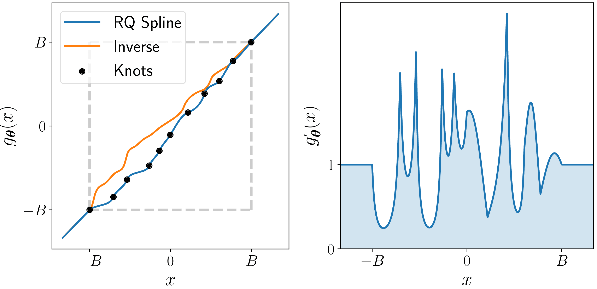
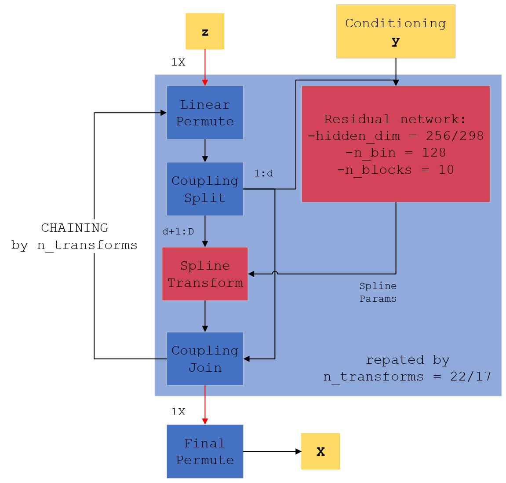
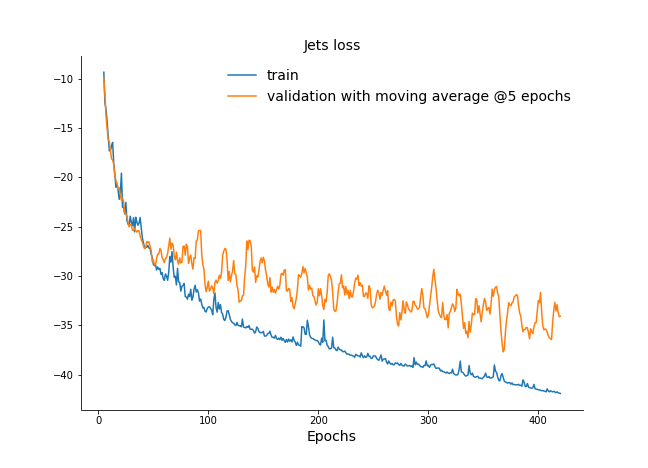
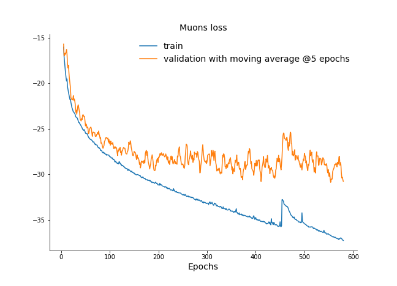

## A brief intro to Normalizing Flows
Normalizing flows are a family of methods for constructing flexible learnable probability distributions, often with neural networks, which allow us to surpass the limitations of simple parametric forms to represent high-dimensional distributions. Our specific goal is to represent, in fact *learn from data*, the underlying $p^*_x(\mathbf{x})$ for our FullSim simulated samples $\mathbf{x}$ with this formalism, so that we may then draw new, original samples from it.

### Basics

The basic idea is to define a multidimensional distribution $p_x(\mathbf{x})$ by passing *random variables* $\mathbf{z} \in \mathbb{R}^D$ drawn from a simple *base distribution* $p_z(\mathbf{z})$, typically a multi-dimensional Gaussian, through a non-linear, *invertible* and *differentiable* transformation *f*: $\mathbb{R}^D \rightarrow \mathbb{R}^D$, $\mathbf{x} = f(\mathbf{z})$. *f* can also be called a *bijection*.

Because $\mathbf{x} = f(\mathbf{z})$, $p_x(\mathbf{x})$ can be expressed as:

$$
p_x(\mathbf{x}) = p_z(\mathbf{z})\det\left|\frac{d\mathbf{z}}{d\mathbf{x}}\right|
$$

Intuitively, if we compose such bijective transformations, $f = (f_{(1)}\circ f_{(2)}\circ\cdots\circ f_{(K)})$, we obtain more *expressive* transforms, thus being able to produce very complicated distributions. In order to do so, we would like to factorize the contribution of each single $f_i$.
Remembering that *f* is invertible, taking the logarithm of both sides we get:

$$
		\log(p_x(x)) = \log(p_z(f^{-1}(\mathbf{x})))+\log\left(\det\left|\frac{d\mathbf{z}}{d\mathbf{x}}\right|\right)
		= \log(p_z(f^{-1}(\mathbf{x})))-\log\left(\det\left|\frac{d\mathbf{x}}{d\mathbf{z}}\right|\right)
$$

where $d\mathbf{z}/d\mathbf{x}$ denotes the Jacobian matrix of $f^{-1}(\mathbf{x})$, $\mathbb{J}_{f^{-1}}(\mathbf{x})$.
Intuitively, this equation says that the density of $x$ is equal to the density at the corresponding point in $z$ plus a term that corrects for the warp in volume around an infinitesimally small volume around $x$ caused by the transformation.
 It is clear that, if we have $K$ transforms $f_{(1)}, f_{(2)},\ldots,f_{(K)}$, then the log-density of the transformed variable $\mathbf{x}=(f_{(1)}\circ f_{(2)}\circ\cdots\circ f_{(K)})(\mathbf{z})$ is:
	
$$
			\begin{aligned}
			\log(p_x(\mathbf{x})) &= \log\left(p_z\left(\left(f_{(K)}^{-1}\circ\cdots\circ f_{(1)}^{-1}\right)\left(\mathbf{x}\right)\right)\right)+\\
			&+\sum^{K}_{k=1}\log\left(\left|\frac{df^{-1}_{(k)}(\mathbf{x}_{(k)})}{d\mathbf{x}'}\right|\right)
		\end{aligned}
$$
	
This relationship between the base distribution and the transformed one through this chain of invertible transforms is at the core of the NF approach and is illustrated in the following figure: how can we find a chain of invertible transformations to send $p_z(\mathbf{z})$ to $p_x(\mathbf{x})$? Taken from [here][2].


Based on this, the idea is to define some kind of measure, which can then be used as the objective function to minimize, to learn the optimal transformation *f* for defining the target $p_x(\mathbf{x})$, so that sampling becomes as easy as sampling a multi-dimensional Gaussian.

### Loss function

As the idea is to leverage deep learning, we let our transformation *f* depend on a set of *learnable* parameters $\phi$, $f = f(\mathbf{x};\, \phi)$. It should be noted that $\phi$ can actually be a *learnable function* of some parameters, rather than a constant. This will enable us to define conditional pdfs as we will see in the following.


In our HEP case, we have billions of available Monte Carlo data and no analytical pdf $p_x^*(\mathbf{x})$. Then, we may define as our loss function the **forward Kullback-Leibler divergence** between the target distribution $p_x^*(\mathbf{x})$ and the flow-defined one $p_x(\mathbf{x}; \, \phi)$:

$$
    \begin{aligned}
    \mathcal{L}(\phi) &= \mathcal{D}_{KL}[p_x^*(\mathbf{x})||p_x(\mathbf{x}; \, \phi)]\\
    &= -\mathbb{E}_{p_x^*(\mathbf{x})}[\log(p_x(\mathbf{x}; \, \phi))] +\; \text{const.}\\
    &= -\mathbb{E}_{p_x^*(\mathbf{x})}[\log(p_z(f^{-1}(\mathbf{x}; \, \phi)))+\log\left(\det\mathbb{J}_{f^{-1}}(\mathbf{x}; \, \phi)\right)] +\; \text{const.}
    \end{aligned}
$$

Supposing we had a set of training samples $\{\mathbf{x}\}^N_n$ from the target pdf, we may estimate the expectation value over $p_x^*(\mathbf{x})$ by Monte Carlo as:

$$
\mathcal{L}(\phi) \approx -\frac{1}{N} \sum_n [\log(p_z(f^{-1}(\mathbf{x}; \, \phi)))+\log\left(\det\mathbb{J}_{f^{-1}}(\mathbf{x}_n; \, \phi)\right)] +\; \text{const.}
$$

Note that, in comparison with other generative models such as GANs, a decrease in the loss function actually implies an improvement in the performance of the model.
For computing this loss we need to calculate $f^{-1}$, its Jacobian determinant and the density $p_z(f^{-1}(\mathbf{x}; \, \phi))$.

### Coupling layers
One simple way to reduce the computational complexity of the Jacobian is to introduce *coupling layers*. 
We partition the input $\mathbf{z} \in \mathbb{R}^D$ *at any step in the network*, being it the original Gaussian input or the output of some $f_{i-1}$, into two subsets $(\vec z_{1:d}, \, \vec z_{d+1:D}) \in \mathbb{R}^d \times \mathbb{R}^{D-d}$, where *d* is an integer between 1 and *D*, and is usually taken as $\lceil D/2 \rceil$. Then, at each step, the transformation $f_i$ is defined as:

$$
f_i(\mathbf{z}; \, \phi) = f_i(\vec z_{d+1:D}; \, \phi(\vec z_{1:d}))
$$

that is, the single transformation acts only on a *subset* of the input, keeping the other part unchanged and using it as *conditioning* for the actual parameters. 

At the end, the two subset are joined together to form the input for the next layer; by applying permutations between the indexes we can ensure that eventually all values of the input get transformed. (Specifically, we point out that if we simply apply *linear* permutations and we chain a number of transformations equal to the input dimension, eventually each variable will be transformed based on the conditioning of all the other ones at some point in the network. This means that the total transform will learn to generate final values which are correctly *correlated* to those for the others.)
But the greatest advantage is that now the single transformation depends only on one subset of inputs, and thus its Jacobian is *block triangular*:

$$
\mathbb{J}_{f}(\mathbf{x}; \, \phi) = 
\begin{pmatrix}
\frac{\partial \vec x_{1:d}}{\partial \vec z_{1:d}} & \frac{\partial \vec x_{1:d}}{\partial \vec z_{d+1:D}}\\
\frac{\partial \vec x_{d+1:D}}{\partial \vec z_{1:d}} & \frac{\partial \vec x_{d+1:D}}{\partial \vec z_{d+1:D}}
\end{pmatrix}
=
\begin{pmatrix}
\mathbb{I} & 0\\
A & \mathbb{J}^*
\end{pmatrix}
$$

The full Jacobian determinant can simply be calculated from the product of the diagonal elements of $\mathbb{J}^*$, which are simply the partial derivatives over ($d+1, \dots D$). A similar reasoning holds for the Jacobian of the inverse.
This significantly speeds up the calculations.

### Splines 
So far, we did not define the family of functions to use as our $f_i(\vec z_{d+1:D}; \, \phi(\vec z_{1:d}))$.
There are many possible bijections which one can use in building a NF. Recent advancements have demonstrated the suitability of *rational-quadratic spline transforms* (see [Durkan et al.][3]). 

A monotonic spline is a piecewise function consisting of K segments, where each segment is a simple function that is easy to invert. Specifically, given a set of K+1 input locations $l_{0}, \dots, l_K$ , the transformation
is taken to be a simple monotonic function (e.g. a low-degree polynomial) in each interval
[$l_{k}, l_{k+1}$], under the constraint that the K segments meet at the endpoints.
Outside the interval [$l_{0}, l_K$], the transformer can default to a simple function such as the
identity. Typically, the parameters $\phi$ of the transformations are the input locations, 
the corresponding output locations and (depending on the type of spline) the
derivatives (i.e. slopes) at $l_{0}, \dots, l_K$. An example is illustrated in the following figure:



Spline-based transformers are as fast to invert as to evaluate, while
maintaining exact analytical invertibility. Evaluating or inverting a spline-based transformer
is done by first locating the right segment--which can be done in $\mathcal{O}$(log K) time using binary
search—and then evaluating or inverting that segment, which is assumed to be analytically
tractable. By increasing the number of segments K, a spline-based transformer can be
made arbitrarily flexible.

### Conditioning

The theory of Normalizing Flows is also easily generalized to conditional distributions. We denote the variable to condition on by $C=\mathbf{c}\in\mathbb{R}^M$. A simple multivariate source of noise, for example a standard i.i.d. normal distribution, $\mathbf{z}\sim\mathcal{N}(\mathbf{0},I_{D\times D})$, is passed through a vector-valued bijection that also conditions on C, $f:\mathbb{R}^D\times\mathbb{R}^M\rightarrow\mathbb{R}^D$, to produce the more complex transformed variable $\mathbf{x}=f(\mathbf{z};\, \phi(C))$. 

In practice, this is usually accomplished by making the parameters for a known normalizing flow bijection $f$ the output of a neural network that inputs $\mathbf{c}$ as well as one of the subsets of the coupling layer. It is thus straightforward to condition event generation on some ground truth, e.g. the Monte Carlo Gen values of a specific event that we wish to simulate. For example, the reconstructed transverse momentum $p_T$ for a jet is expected to be positively correlated to the Gen $p_T$, as are its mass and other key quantities; so we pass the Gen values as inputs to $\phi$.

## Models

The following figure shows the final architectures for both jets and muons.  Where two numbers are separated by a slash, the first refers to the muons model, the second to the jets one.



The figure shows the final models employed in this work. 
As discussed before, the full model is composed of a *chain* of individual spline transformations, which act on only *half* of the input space and take the remaining half as additional parameters. Each spline acts after the preceding one: only the first one takes the actual random noise as input, while the following ones act on the transformed output of the previous steps. The *conditioning* Gen-level variables are instead passed as input to each step. By having a number of transforms in the chain equal to the full input size, we can be sure that the transformation of each single variable will eventually depend on all the other ones (as at each step half of the inputs is taken as parameters) thus ensuring the correct *correlations* in the final outputs.

For each spline, the inputs are permuted and then splitted in half, sending half as parameters and half as argument of the *spline transform*. The conditioning Gen-level variables **y** are sent as input to a complex 10 layer fully-connected *residual* network (a different one for each transform) which defines the parameters for the spline. Its most relevant hyperparameters are the *hidden\_dim*, the number of nodes per hidden layer, set to 256 for the muons model and to 298 for the jets one, the *n\_bin*, the number of bins for the spline, set to 128 for both models and the *n\_blocks* set to 10 for both and defining the number of hidden layers.

## Key training concepts

The code for the training is commented (see [the GitHub repo][1]), thus you should be able to infer most of the steps from comments alone.
This page serves to discuss the most relevant training facts and choices in terms of hyperparameters, and to point at possible improvements and variations.

We trained on 5 millions jet/muons from the $t\overline{t}$ process and validated on 100k jets/muons. The typical training times on a V100 32gb GPU were about 5 days for both models.

The most relevant hyperparameters are defined in the snippet below (for the jets model):

```py
    # define hyperparams
    lr = 1e-5
    total_epochs = 600
    batch_size = 2048

    #stuff 

    # define additional model parameters
    param_dict = {
        "num_transform_blocks": 10,
        "activation": "relu",
        "batch_norm": True,
        "num_bins": 128,
        "hidden_dim": 298,
    }

    # create model
    flow = create_NDE_model(17, 14, 17, param_dict)
```

We will proceed to list them with a brief explanation for the chosen value:

- The *learning rate* has been fixed to a relatively small value for two main reasons. Having 50+ millions of parameters for the full model, we wanted a smooth descent, without overshooting. A small value helped in this regard, however we experimented with values of around 0.001 and found that the model was still capable of convergence in way less epochs. However, letting the training go on longer with a lower lr resulted in better results regarding the *conditioning* (how the Gen-level information influences the outputs), a feature not captured by the loss. We thus left a smaller value than what's actually needed.
- *Epochs* and *batch size* have been guessed as reasonable values after a few initial trainings. With such a large training sample, a large batch size helped with both training speed and by providing a large number of events to average upon (useful for our loss)
- The *param dict* defines key quantities for our neural networks defining the single *splines* of the full NF model:
  - *number of transformation blocks*: specifying how many layers the network should have;
  - *activation type*: we found the ReLU reliable as always;
  - *batch normalization*: we turned it on as it supposedly helps with large models such as ours;
  - *number of bins*: how many bins should the spline defined by the neural network have. This is actually a key parameter, and we had massive improvements once we switched from low numbers to higher ones. **We could experiment with increasing this number while reducing layers/blocks**;
  - The *hidden dimension* specify how many nodes per layer the network should have.
- Finally, while creating the full model we must specify three numbers: the input variables number, the conditioning variables number and the *number of flow steps*, specifying how many splines the full model should have. We went with the exact same number as the input parameters. Because of the linear permutations and the coupling split at each flow step, this meant that eventually all variables will be generated with the others as conditioning--an ideal scenario for ensuring good correlations.

## Dataset classes

Remember that we trained on 5 millions of jets/muons. Because jets are numerous in our training process ($t\overline{t}$), we used a simple dataset for jets as we needed to open just one file to access the whole 5 millions jets.


```py
class MyDataset(Dataset):
    """Very simple Dataset for reading hdf5 data
        This is way simpler than muons as we heve enough jets in a single file
        Still, dataloading is a bottleneck even here
    Args:
        Dataset (Pytorch Dataset): Pytorch Dataset class
    """

    def __init__(self, h5_paths, limit):

        self.h5_paths = h5_paths
        self._archives = [h5py.File(h5_path, "r") for h5_path in self.    h5_paths]
        self._archives = None

        y = self.archives[0]["data"][:limit, 0:14] # conditioning
        x = self.archives[0]["data"][:limit, 14:31] # targets
        self.x_train = torch.tensor(x, dtype=torch.float32)  # .to(device)
        self.y_train = torch.tensor(y, dtype=torch.float32)  # .to(device)

    @property
    def archives(self):
        if self._archives is None:  # lazy loading here!
            self._archives = [h5py.File(h5_path, "r") for h5_path in self.h5_paths]
        return self._archives

    def __len__(self):
        return len(self.y_train)
    # trivial get item by index
    def __getitem__(self, idx):
        return self.x_train[idx], self.y_train[idx]
```

Because muons are more scarce, we actually had to open up multiple files during training to have at our disposal the 5 millions. The dataset is thus more complex:

```py
class H5Dataset(Dataset):
    """Pytorch Dataset for reading input data from hdf5 files on disk
    Expects hdf5 files containing a "data" Dataset, which in turn contains correctly processed data
    (there is no preprocessing here), and returns two separate tensor for each instance
    Uses np.searchsorted to getitems from different files (thanks @Nadya!)
    However, dataloading is a current bottleneck and should be investigated
    x: target variables (expects a 30:52 ordering on each row)
    y: conditioning variables (expects a 0:30 ordering on each row)
    Args:
        Dataset (Pytorch Dataset): Pytorch Dataset class
    """

    def __init__(self, h5_paths, limit=-1):
        """Initialize the class, set indexes across datasets and define lazy loading
        Args:
            h5_paths (strings): paths to the various hdf5 files to include in the final Dataset
            limit (int, optional): optionally limit dataset length to specified values, if negative
                returns the full length as inferred from files. Defaults to -1.
        """
        max_events = int(5e9)
        self.limit = max_events if limit == -1 else int(limit)
        self.h5_paths = h5_paths
        self._archives = [h5py.File(h5_path, "r") for h5_path in self.h5_paths]

        self.strides = []
        for archive in self.archives:
            with archive as f:
                self.strides.append(len(f["data"])) 

        self.len_in_files = self.strides[1:]
        self.strides = np.cumsum(self.strides)
        self._archives = None

    @property
    def archives(self):
        if self._archives is None:  # lazy loading here!
            self._archives = [h5py.File(h5_path, "r") for h5_path in self.h5_paths]
        return self._archives

    # smart get item through searchsorted for finding the right file
    # and getting the actual index in the file
    def __getitem__(self, index):
        file_idx = np.searchsorted(self.strides, index, side="right")
        idx_in_file = index - self.strides[max(0, file_idx - 1)]
        y = self.archives[file_idx]["data"][idx_in_file, 0:30]
        x = self.archives[file_idx]["data"][idx_in_file, 30:52]
        y = torch.from_numpy(y)
        x = torch.from_numpy(x)
        # x = x.float()
        # y = y.float()

        return x, y

    def __len__(self):
        # return self.strides[-1] #this will process all files
        if self.limit <= self.strides[-1]:
            return self.limit
        else:
            return self.strides[-1]
```

Despite the different approaches, we observed that **the data loading step may actually be a severe bottleneck in our training** as the GPU utilization heavily fluctuated between 40% and 70% most of the time. When we tried to implement a dataset similar to the muons' one for the jets we observed a significant slowdown, suggesting that the dataset classes may be part of the problem.

## Cosine annealing

It should be noted that the learning rate for both models was constantly updated through the *cosine annealing* procedure.

Cosine Annealing is a type of learning rate schedule that has the effect of starting with a large learning rate that is relatively rapidly decreased to a minimum value before being increased rapidly again. The resetting of the learning rate acts like a simulated restart of the learning process and the re-use of good weights as the starting point of the restart is referred to as a *warm restart* in contrast to a *cold restart* where a new set of small random numbers may be used as a starting point. The proper formula is:

$$\eta_{t} = \eta_{min} + \frac{1}{2}\left(\eta_{max}-\eta_{min}\right)\left(1+\cos\left(\frac{T_{cur}}{T_{max}}\pi\right)\right)$$

were $\eta$ is the learning rate and $T$ the training epoch.

## Training losses

We show here the losses for both models during training. Please note that the validation loss has been averaged over the last 5 epochs.






The jets model shows clear signs for improvements, but it was stopped because we had to put results together for my thesis. The muons models, on the other hand, shows signs of stalling after epoch 200, but it was left in training as this vastly improved *conditioning*, a performance not captured by our loss.

 [1]: <https://github.com/francesco-vaselli/FlashSim/tree/main/trainings> "The git repo, training section" 
 [2]: <https://lilianweng.github.io/posts/2018-10-13-flow-models/> "The figure source" 
 [3]: <https://arxiv.org/abs/1906.04032> "Ref paper"